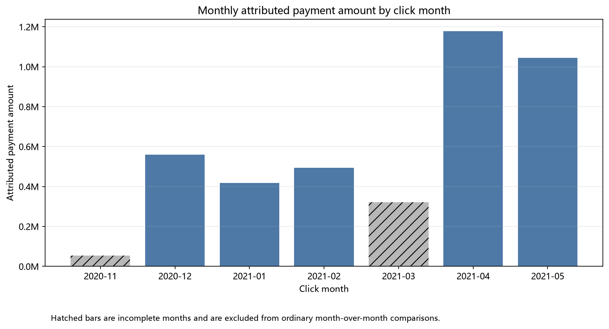
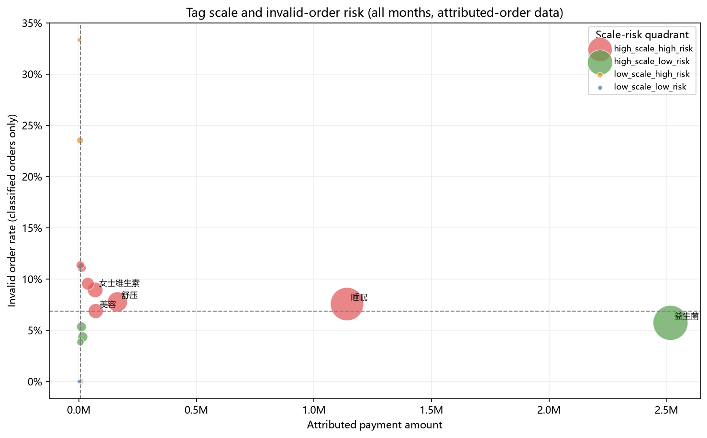
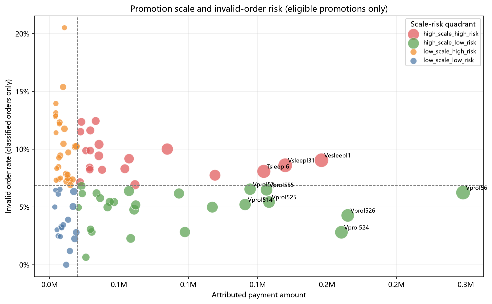

# 淘宝归因订单表现分析

这是一个用于作品集展示的可复现数据分析项目。项目将 7 个月的淘宝归因订单明细与 SKU 标签参考表结合，完成商品结构、推广位归因表现和订单失效风险分析。

## 业务问题

在保留订单失效风险和数据限制的前提下，如何利用归因商品订单明细，为商品标签和推广位的复盘确定优先级？

## 数据范围与口径

| 项目 | 已核验值 |
|---|---:|
| 商品订单明细数 | 31,036 |
| 去重后的淘宝订单编号数 | 27,521 |
| SKU 数（商品 ID） | 65 |
| 推广位数 | 253 |
| 点击日期范围 | 2020-11-14 至 2021-05-31 |
| 归因付款金额 | 4,072,492.00 |
| 主失效订单率 | 6.86% |
| 零付款商品订单明细率 | 8.02% |

源数据的一行是归因**商品订单明细**，并不等于一个独立订单。订单分析按 `淘宝订单编号` 聚合；SKU 关联以 `商品ID` 为主键。

文中的 `付款金额` 统一称为**归因付款金额**，不代表真实营收、结算收入、佣金、利润或 ROI。

2020 年 11 月和 2021 年 3 月为不完整月份，未纳入普通月环比。

## 已核验发现

- 益生菌标签的归因付款金额为 251.65 万元，占总额 61.8%，主失效订单率为 5.72%；睡眠标签的归因付款金额为 114.04 万元，占总额 28.0%，主失效订单率为 7.56%，零付款商品订单明细率为 17.34%。
- 2021 年 4 月和 5 月均为完整月份。5 月归因付款金额较 4 月下降 11.4%，零付款商品订单明细率从 4.0% 升至 23.7%。这是需要排查的信号，不构成需求变化或因果影响的证据。
- 在“归因订单数不少于 30、活跃天数不少于 7”的推广位比较范围内，`VesleepI1`、`VsleepI31`、`TsleepI6` 的归因付款金额规模较大，且主失效订单率高于整体 6.86% 基准。它们是复盘候选对象，并非加预算建议。

证据、口径和限制见：[分析发现](docs/analysis_findings.md)、[业务建议](docs/business_recommendations.md)、[分析验证](docs/analysis_validation.md)。







## 仓库结构

```text
├── data/
│   ├── raw/                 # 仅本地保存的原始数据放置说明
│   └── processed/           # 仅本地生成的清洗分析表
├── docs/                    # 指标口径、质量说明、发现、建议和验证
├── notebooks/               # 可复现的数据准备与分析过程
├── outputs/
│   ├── analysis/            # 汇总 CSV 和分析摘要 JSON
│   ├── data_quality/        # 自动生成的质量报告与摘要
│   └── figures/             # 汇总图表
├── src/
│   ├── build_datasets.py    # 生成三张本地清洗分析表
│   └── analyze_performance.py
├── tests/
└── requirements.txt
```

## 本地复现

由于尚未确认原始数据的再分发授权，公开仓库不包含原始工作簿。请在本地准备 `淘宝订单数据by点击日期` 文件夹中的 7 个按月原始文件，以及 `淘宝sku标签.xlsx`。

```powershell
python -m venv .venv
.\.venv\Scripts\Activate.ps1
pip install -r requirements.txt

python src\build_datasets.py `
  --raw-dir "..\淘宝订单数据by点击日期" `
  --label-file "..\淘宝sku标签.xlsx"

python src\analyze_performance.py
python tests\test_pipeline.py
```

数据准备脚本会在本地生成：

- `data/processed/order_lines_clean.csv`
- `data/processed/orders_clean.csv`
- `data/processed/sku_dimension.csv`

## 重要限制

- 结算时间、结算金额、佣金金额和淘宝子订单号在源文件中均为空，因此本项目不计算结算、佣金、利润或 ROI。
- 缺少曝光、总点击量和投放成本，因此不计算点击率、完整转化率、投放效率或推广位的因果影响。
- 缺少用户 ID，因此不做留存、复购、RFM 或用户画像分析。
- `non_invalid_order`（非完全失效订单）不等同于完成成交；混合状态订单会单独展示，且不进入主失效订单率分母。

## 工具

Python、Pandas、Matplotlib、Jupyter、Tableau（历史探索工作簿）。

