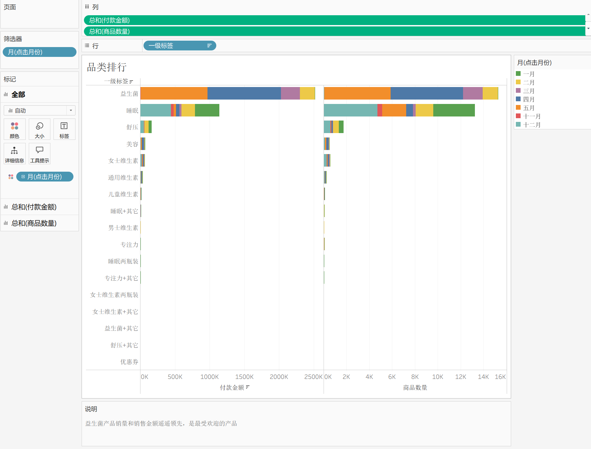
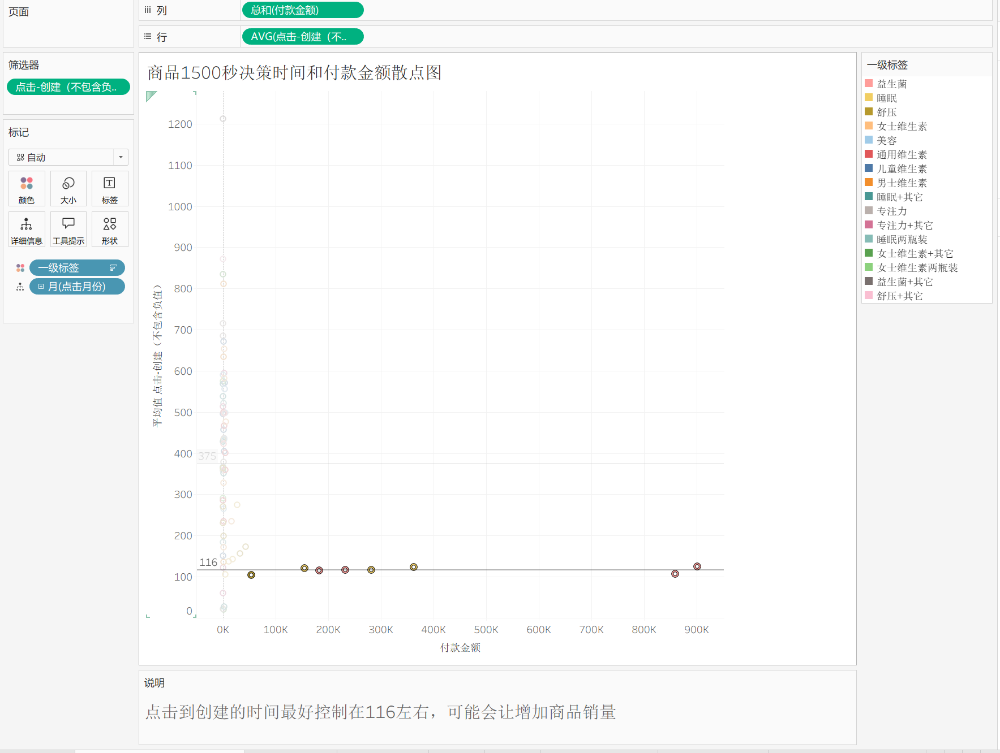
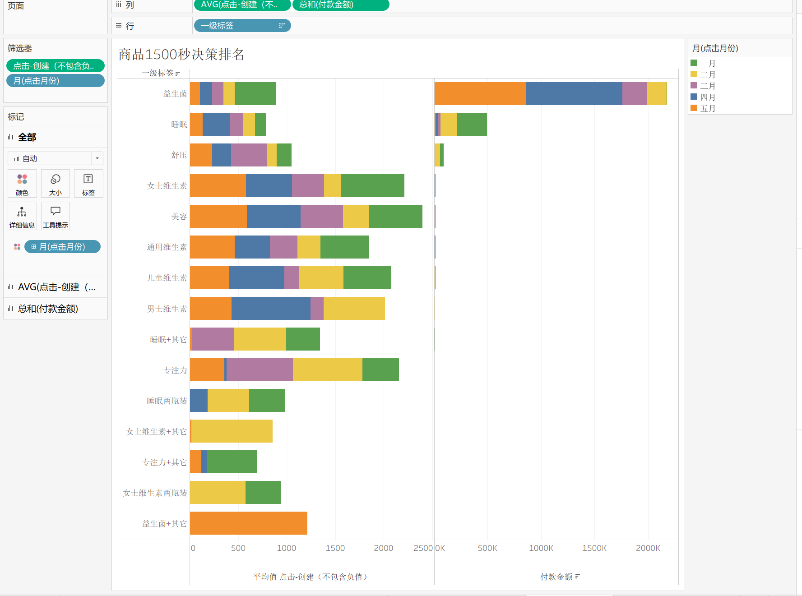
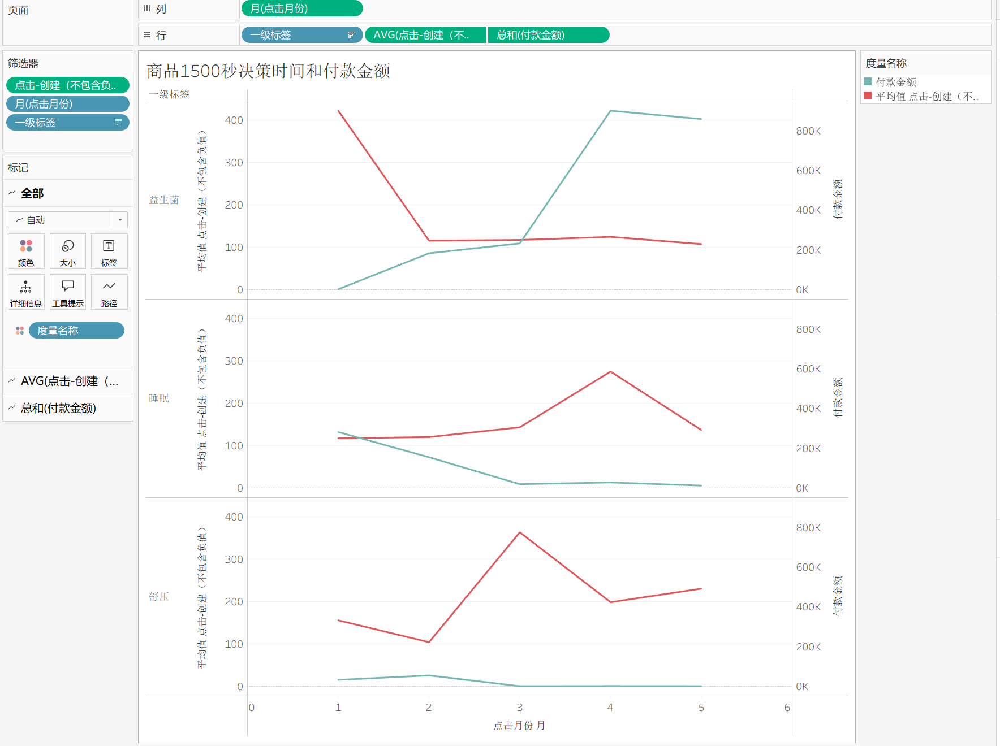
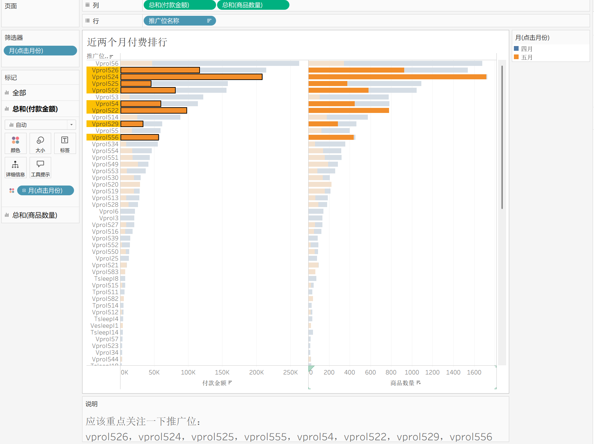
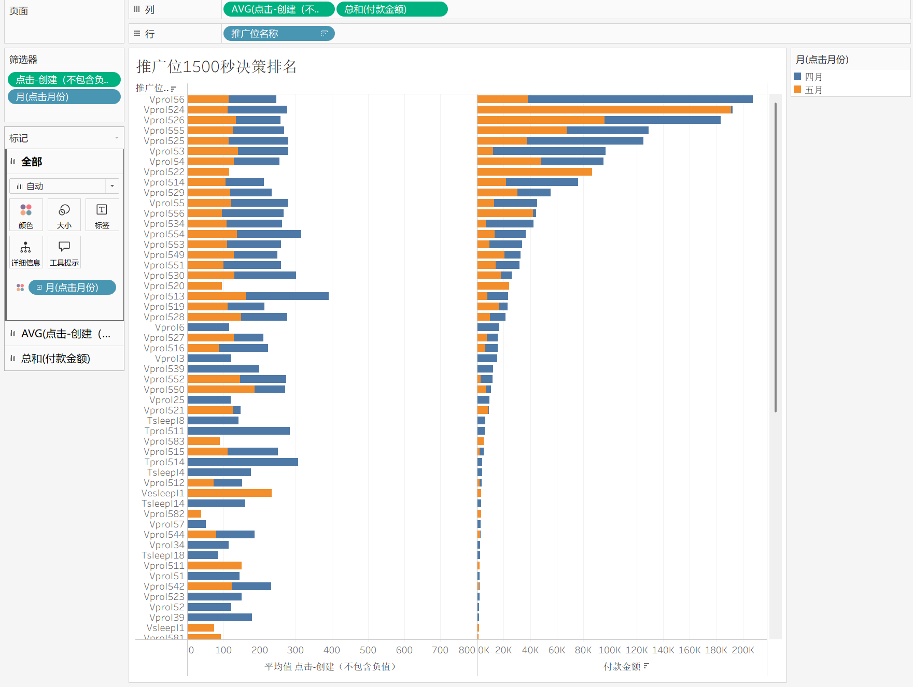
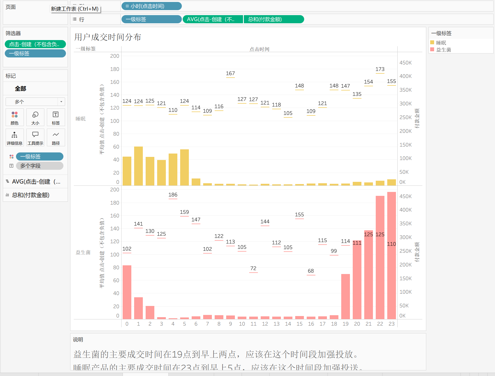
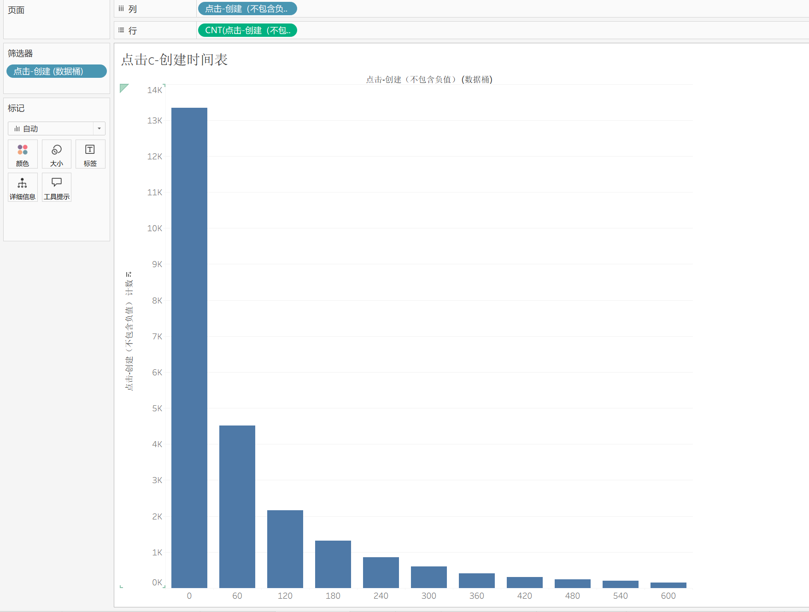
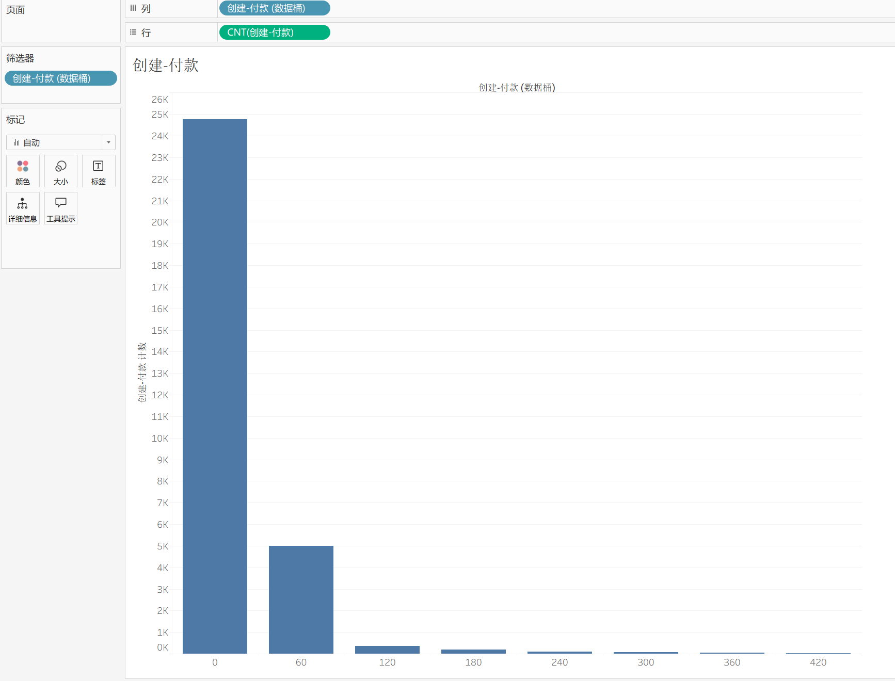
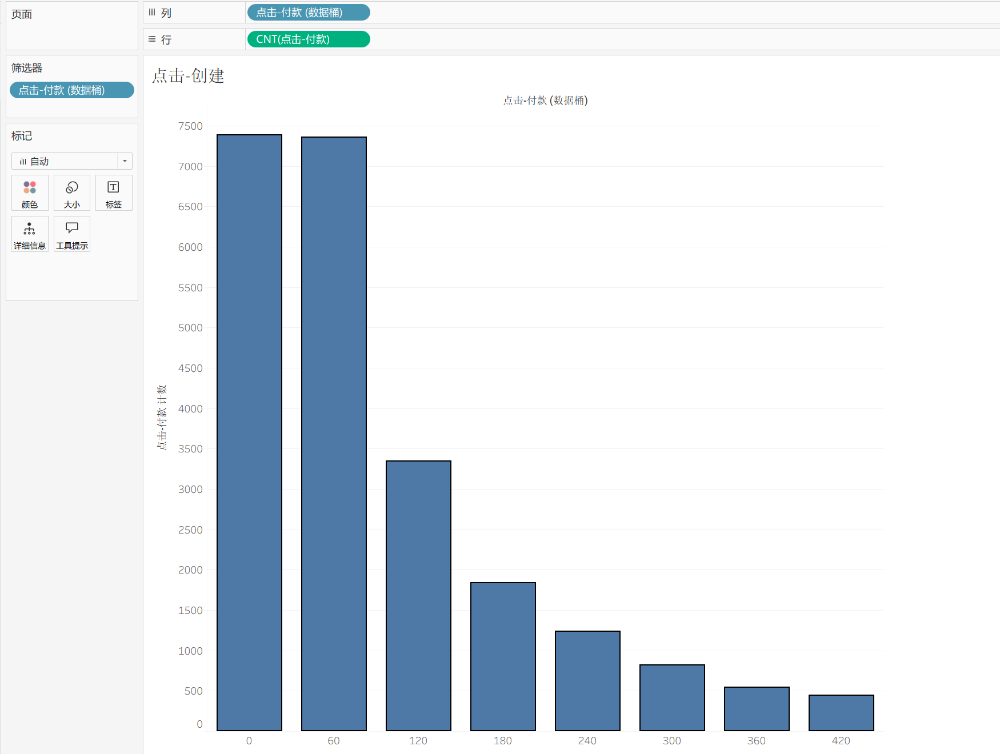

# 淘宝商品与推广位分析（Tableau）

这是一个基于 Tableau 工作簿完成的电商分析项目。仓库保留原始工作簿、10 张由 Tableau 导出的工作表截图，以及与工作表说明一致的分析记录；不包含任何重新计算或另行绘制的图表。

## 分析内容

- 按一级标签对比付款金额和商品数量，并按点击月份查看结构变化。
- 分析点击、创建、付款三个时间节点的分布。
- 对比商品标签与推广位的“点击到创建”时间及付款金额。
- 查看益生菌与睡眠产品的成交时段，以及近两个月的推广位表现。

## Tableau 工作簿中的结论

- **品类排行**：益生菌产品销量和销售金额遥遥领先，是最受欢迎的产品。
- **商品 1500 秒决策时间和付款金额散点图**：点击到创建的时间最好控制在 116 左右，可能会让增加商品销量。
- **用户成交时间分布**：益生菌的主要成交时间在 19 点到早上两点；睡眠产品的主要成交时间在 23 点到早上 5 点。工作簿说明建议在相应时间段加强投放。
- **近两个月付费排行**：工作簿说明建议重点关注 `vprol526`、`vprol524`、`vprol525`、`vprol555`、`vprol54`、`vprol522`、`vprol529`、`vprol556`。

完整的工作表说明和图表对应关系见 [Tableau 分析记录](docs/tableau_analysis_notes.md)。

## Tableau 图表

### 品类与商品分析









### 推广位与成交时间分析







### 时间分布







## 仓库结构

```text
├── tableau/
│   ├── 电商数据分析.twb      # Tableau 工作簿（已移除本机路径）
│   └── README.md             # 本地连接数据源的说明
├── outputs/tableau_worksheets/
│   └── 01-10_*.png           # Tableau 工作表原始截图
└── docs/tableau_analysis_notes.md
```

## 使用方式

下载 [电商数据分析.twb](tableau/电商数据分析.twb) 后，在 Tableau Desktop 中重新连接本地的 `合并淘宝表格.xlsx` 与 `淘宝sku标签.xlsx`，即可查看和继续编辑工作表。

原始 Excel 数据未公开上传。

## 工具

Tableau、Excel
